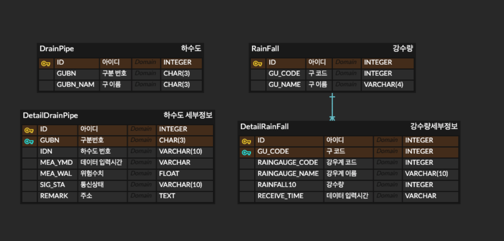
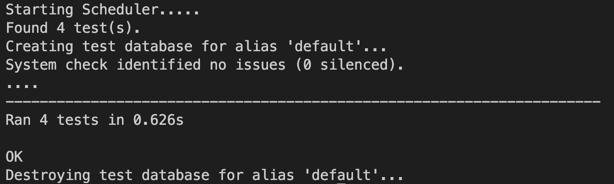

## ✅ Labq_Service API

요구사항
- 서울시 OpenAPI를 이용, API호출시 구분코드에 대한 하수도와 강수량 데이터 조합해서 출력

<br>
<br>

## ✅ 개발 인원
- Back-end  : 김도연

<br>
<br>

## ✅ 개발 기간
- 2022.11.07 ~ 2022.11.10 (4일)

<br>
<br>

## ✅ 1차목표 & 2차목표

- 1차 목표
    - OpenAPI 요청 후 실시간으로 데이터를 출력  

<br>

- 2차 목표
    - Database에 OpenAPI 호출 최신 데이터 저장 후 출력
    - Scheduler를 이용해서 정해진 시간마다 DB데이터 최신화
    - 강수량과 하수도수위가 일정 수준 넘었을시 Slack bot을 이용한 메시지 보내기 

<br>
<br>

## ✅ DB 모델링 

<br>
<p align="center"></p>


<br>

### 주요 관계

- 하수관테이블과 하수관 상세정보 테이블
    - 하나의 "구" 에는 여러개의 하수관이 존재한다. 

<br>

- 강수량테이블과 강수량 상세정보 테이블
    - 하나의 "구" 에는 여러개의 강수측정기가 존재한다.

<br>
<br>
<br>

## ✅ Directory 구조
```
.
├── __pycache__
├── api(1차목표)
├── api2(2차목표)
    ├── utils(    
├── api2(2차목표)
    ├── data_schedule
    ├── slack_bot
    ├── utils    
├── configs
├── decorators
├── labq_service
├── exceptions.py
├── manage.py
└── requiremenets.py
 
```
<br>
<br>
<br>

## ✅ 백엔드 역할

```
  - 1차 목표
    - OpenAPI 최신데이터 요청  
    - (GET) 최신데이터 출력
  
  - 2차 목표     
    - Scheduler
    - OpenAPI 최신데이터 요청
    - 최신데이터 데이터베이스 저장
    - (GET) 최신데이터 출력
    - Slack Bot
    
```

<br>

### (1차, 2차) OpenAPI 최신데이터 요청

- 어려웠던점
    - 문제1 :  하수도의 데이터가 시간을 기준으로 오름차순으로 되어있기 때문에 최신데이터를 위해서 어떻게 해야할지 고민이 되었다.

<br>

- 구현방법
    - 해결 : 두번의 요청으로 문제를 해결했다. 먼저 처음의 요청에서 전체 리스트의 수를 반환뒤, 뒤에서 부터 "구"별로 가지고 있는 IDN수를 뺌으로써 데이터 요청 시 start_idx를 구할 수 있었다.
    
    - 두번의 요청으로 해결을 했으나, 이 방법이 좋은 방법인지는 의문이다. 한번의 요청으로 해결을 위해서는 대략 몇천건의 데이터를 받아와서 뒤에서 짤라야한다는 점에서 무의미한 데이터를 받는게 아닌가 하는 생각이 들어서 두번의 요청으로 문제를 해결했으나, 다른 방법이 있을 지 궁금하다.

<br>

- 회고점
    - 2차 목표를 달성하기 위해 같은 요청을 보내야 되는데, API로직 자체에 구현한 것이 아닌 따로 구현을 했기 때문에 재사용을 할 수 있었다는 점에서 효율적이었던 거 같다.
<br>
<br>

### (1차) 최신데이터 출력

- 구분 코드 입력시 위에서 구현한 최신데이터 요청 받은 데이터를 serializer를 통해 유효성 검사를 한 뒤 바로 출력하는 방법으로 구현했다.

- SerializerMethodField를 활용해서 강수량과 하수도 수위에 대한 특정 범위를 지났을 경우 위험을 출력하는 코드를 작성했다.

<br>

### (2차) Scheduler

- 실시간 데이터를 위해서, 서버가 돌아가는 동안 백그라운드로 정해진 시간에 한번씩 OpenAPI 최신데이터를 요청하게 구현했다.


<br>

### (2차) 최신데이터 DB에 저장

- serializer를 이용해서 요청에 대한 응답 데이터에 대한 유효성검사를 진행 후 데이터 저장

- model의 필드명과 serializer의 필드명, 응답하는 데이터의 변수명이 다르기 때문에, serializer의 souerce 옵션을 이용해서 serializer에 해당하는 필드면을 model에 맵핑해주었다.

<br>

### (2차) 최신데이터 출력

- 데이터베이스에 저장된 최신 정보를 출력한다.
- Scheduler로 업데이트 될 때마다 새로운 최신 정보를 출력한다.

<br>

### (2차) Slack Bot

- 데이터 최신화 될 때마다 변경된 값의 체크 함으로써 Slack Bot을 통해서  메시지를 보내 주었다.

<br>
<br>
<br>


## ✅ 백엔드 기술 스택
  - Back-end : Python, Django, Miniconda, DRF, APscheduler
  - Database : erdcloud, MySQL
  - HTTP     : Postman
  - Common   : Git & Github & Slack Bot

<br>
<br>
<br>

## ✅ API 

<br>

### 1. api

- url: /api/구분코드
- method: GET
- response
    ```json
    {
    "DrainPipi": [
        {
            "IDN": "01-0004",
            "GUBN": 1,
            "GUBN_NAM": "종로",
            "MEA_YMD": "2022-11-10T21:54:05+09:00",
            "MEA_WAL": 0.11,
            "SIG_STA": "통신양호",
            "REMARK": "종로구 세종대로178 뒤 맨홀(KT광화문사옥뒤 자전거보관소앞 종로1길, 미대사관~종로소방서 남측, 중학천 하스박스)",
            "RISK": "경고"
        },
        {
            "IDN": "01-0003",
            "GUBN": 1,
            "GUBN_NAM": "종로",
            "MEA_YMD": "2022-11-10T21:54:05+09:00",
            "MEA_WAL": 0.11,
            "SIG_STA": "통신양호",
            "REMARK": "종로구 자하문로 21 앞 맨홀(영해빌딩앞코너 측구측, 백운동천 하수박스)",
            "RISK": "경고"
        },
        {
            "IDN": "01-0002",
            "GUBN": 1,
            "GUBN_NAM": "종로",
            "MEA_YMD": "2022-11-10T21:54:05+09:00",
            "MEA_WAL": 0.1,
            "SIG_STA": "통신양호",
            "REMARK": "중로구 세종대로 지하189 (세종로지하주차장 6층 천장)",
            "RISK": "경고"
        },
        {
            "IDN": "01-0001",
            "GUBN": 1,
            "GUBN_NAM": "종로",
            "MEA_YMD": "2022-11-10T21:54:05+09:00",
            "MEA_WAL": 0.05,
            "SIG_STA": "통신양호",
            "REMARK": "종로구 새문안로9길 9 앞 맨홀(세븐일레븐앞, 현대해상화재빌딩뒤, 백운동천하수박스)",
            "RISK": "경고"
        }
    ],
    "Rainfall": [
        {
            "RAINGAUGE_CODE": 1002.0,
            "RAINGAUGE_NAME": "부암동",
            "GU_CODE": 110.0,
            "GU_NAME": "종로구",
            "RAINFALL10": 0,
            "RECEIVE_TIME": "2022-11-10T21:29:00+09:00",
            "RISK": "안전"
        },
        {
            "RAINGAUGE_CODE": 1001.0,
            "RAINGAUGE_NAME": "종로구청",
            "GU_CODE": 110.0,
            "GU_NAME": "종로구",
            "RAINFALL10": 0,
            "RECEIVE_TIME": "2022-11-10T21:29:00+09:00",
            "RISK": "안전"
        }
    ]
}
    ```
<br>
<br>


### 2. api2

- url: /api2/구분코드
- method: GET    
- response
    
    ```json
    {
    "하수관": [
        {
            "id": 1,
            "gubn": 1,
            "gubn_nam": "종로"
        },
        [
            {
                "id": 1,
                "idn": "01-0004",
                "mea_ymd": "2022-11-10 17:54:05.0",
                "mea_wal": 0.11,
                "sig_sta": "통신양호",
                "remark": "종로구 세종대로178 뒤 맨홀(KT광화문사옥뒤 자전거보관소앞 종로1길, 미대사관~종로소방서 남측, 중학천 하스박스)",
                "gubn": 1
            },
            {
                "id": 2,
                "idn": "01-0003",
                "mea_ymd": "2022-11-10 17:54:05.0",
                "mea_wal": 0.11,
                "sig_sta": "통신양호",
                "remark": "종로구 자하문로 21 앞 맨홀(영해빌딩앞코너 측구측, 백운동천 하수박스)",
                "gubn": 1
            },
            {
                "id": 3,
                "idn": "01-0002",
                "mea_ymd": "2022-11-10 17:54:05.0",
                "mea_wal": 0.1,
                "sig_sta": "통신양호",
                "remark": "중로구 세종대로 지하189 (세종로지하주차장 6층 천장)",
                "gubn": 1
            },
            {
                "id": 4,
                "idn": "01-0001",
                "mea_ymd": "2022-11-10 17:54:05.0",
                "mea_wal": 0.03,
                "sig_sta": "통신양호",
                "remark": "종로구 새문안로9길 9 앞 맨홀(세븐일레븐앞, 현대해상화재빌딩뒤, 백운동천하수박스)",
                "gubn": 1
            }
        ]
    ],
    "강우량": [
        {
            "id": 1,
            "gu_code": 110,
            "gu_name": "종로구"
        },
        [
            {
                "id": 1,
                "raingauge_code": 1002,
                "raingauge_name": "부암동",
                "rainfall10": 0,
                "receive_time": "2022-11-10 17:29",
                "gu_code": 1
            },
            {
                "id": 2,
                "raingauge_code": 1001,
                "raingauge_name": "종로구청",
                "rainfall10": 0,
                "receive_time": "2022-11-10 17:29",
                "gu_code": 1
            }
        ]
    ]

    ```    

<br>
<br>
<br>

## ✅ UnitTest

<br>

<p align="center"></p>